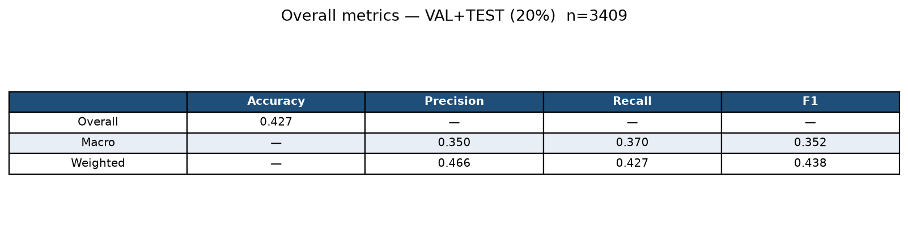
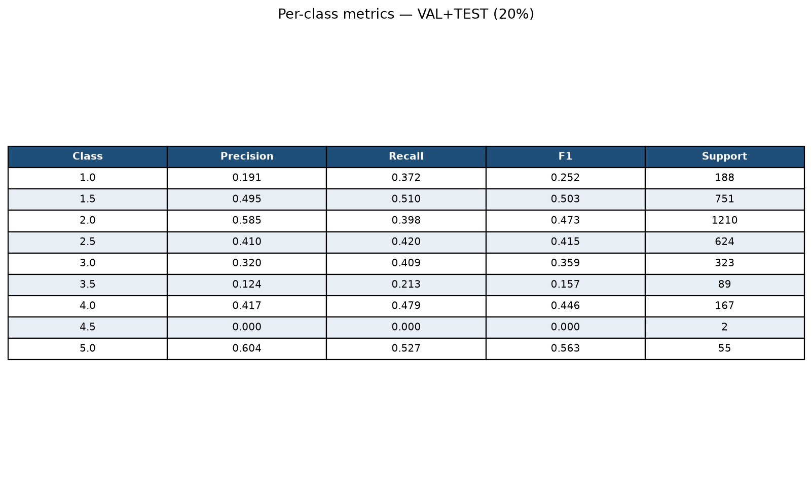
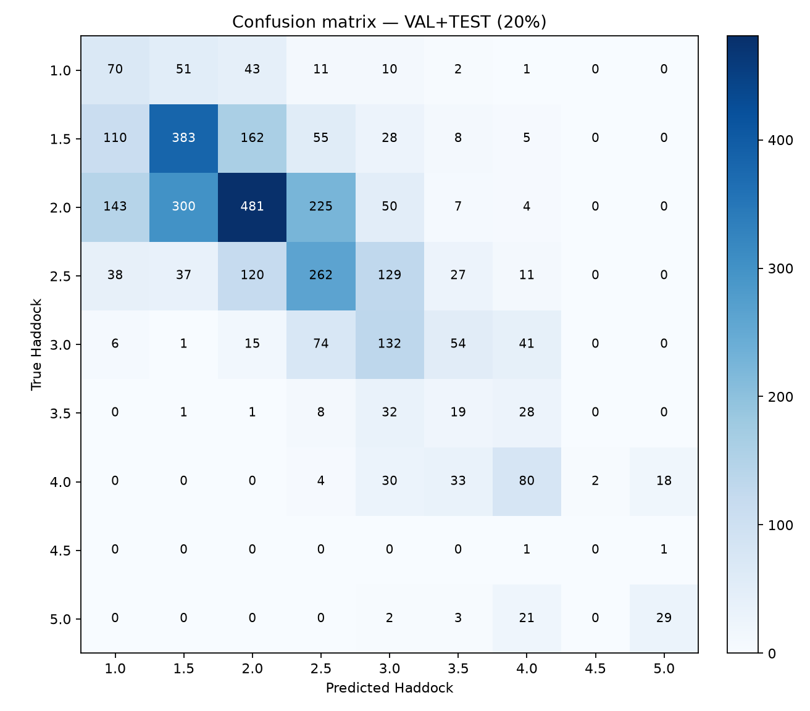

# Determinator 2.0

On-aircraft image-quality check: flag soft or out-of-focus captures while the flight can still retake them, instead of discovering problems after landing.

This repo **trains** a Haddock-score classifier and **exports XGBoost trees** for C++. Production (libDeterminator) cuts five 1024×1024 ROIs, computes the same 13 features, and loads the exported JSON.

```
full frame
    → C++: 5 ROIs (UL, UR, LL, LR, C)
    → C++: 13 features (FEATURE_NAMES order)
    → exported trees (XGBoosterLoadModel)
    → Haddock score 1.0 … 5.0
```

## Ground truth

Labels are **Haddock scores**: a nine-level ordinal scale from **1.0 (sharp) to 5.0 (soft)** in steps of 0.5. Lower is sharper.

## Model and features

**Choice:** gradient-boosted trees (`XGBClassifier`, `multi:softprob`) on a locked **13-feature** vector. That replaces the original Determinator’s hand-designed voting sets. One model is shipped: `xgboost_9_class_13_feat`.

Why this setup:

- Nine raw Haddock classes so C++ reports the same 0.5-step scale as the labelers.
- Thirteen focus/sharpness measures (CompLIB-style operators plus a few modern extras).
- Inverse-frequency **balanced class weights** because mid/high softness bins are rare (especially 4.5).
- Hyperparameters locked after VAL search. Each `train_model.py` run fits a new booster with:

  `n_estimators=600`, `learning_rate=0.05`, `max_depth=5`, `min_child_weight=8`, `subsample=0.8`, `colsample_bytree=0.8`, `gamma=0.3`, `reg_lambda=5.0`, `reg_alpha=1.0`, `tree_method=hist`.

`features.py` is a Python **training port** of the operators (same names and CompLIB-style norm; not bit-identical to C++). Do not reorder `FEATURE_NAMES` without re-exporting trees:

1. `fft_high_freq_ratio`
2. `Sobel2ndOrder5x5`
3. `grad_mean`
4. `Laplacian3x3`
5. `ThresholdGradient`
6. `Sobel2ndOrder3x3`
7. `roi_std`
8. `Vollath5`
9. `LaplacianOfGaussian`
10. `Sobel2ndOrder3x3Cross`
11. `entropy`
12. `modified_laplacian`
13. `Sobel2ndOrder5x5Cross`

## Shipped artifacts

| File | Role |
|------|------|
| `artifacts/models/export/xgboost_9_class_13_feat.json` | Trees for C++ (`XGBoosterLoadModel`) |
| `artifacts/models/export/xgboost_9_class_13_feat.meta.json` | Feature order, classes, Haddock scores |
| `artifacts/models/xgboost_9_class_13_feat.joblib` | Python bundle (inspect / retrain only) |

C++: load the `.json`, pass the 13 features in `feature_names` order, take `argmax` of `multi:softprob`, map the index through `classes` / `class_scores` in the sidecar meta.

## Testing

Splits are **stratified by Haddock class** (80% train / 10% val / 10% test). Results below use VAL + TEST together (**20% holdout**, `n = 3409`).

```bash
pip install -r requirements.txt
python train_model.py --include-test
```

## Results

`xgboost_9_class_13_feat` on **VAL+TEST (20%)**: accuracy **0.427**, macro P/R/F1 **0.350 / 0.370 / 0.352**.






